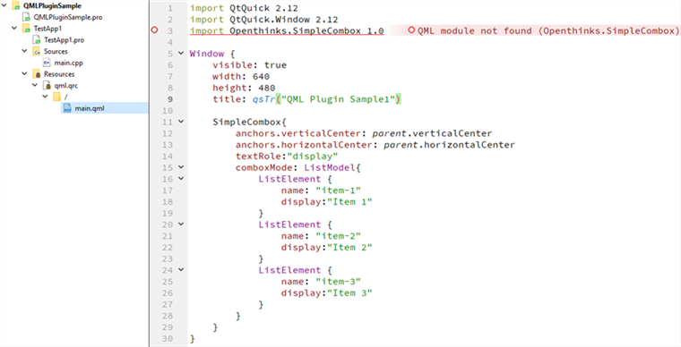
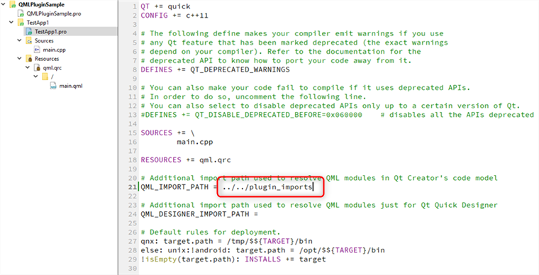
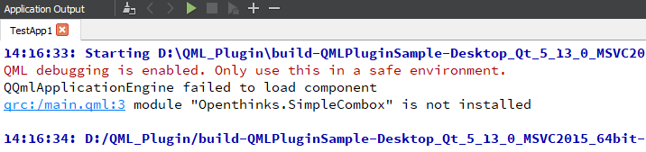
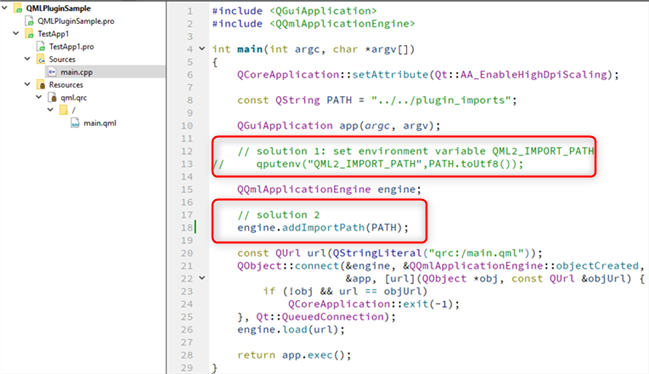

# How to Customize QML Plugin

We create a folder `plugin_imports` as all QML plugin root folder.

## Base QML
### create customized conponment
Here we have customized QML componment: `SimpleCombox.qml`
We put it reference resource into folder `SimpleCombox`.
### create qmldir file
create `qmldir` file to describe customized QML module, content as below
```
module Openthinks.SimpleCombox
SimpleCombox 1.0 SimpleCombox.qml
```
* `Openthinks.SimpleCombox` is module name, it can include parent name, here `Openthinks` is parent module name
*  `SimpleCombox` is customized QML componment name, it will be a QML type name when used.
* `1.0` is componment version
* `SimpleCombox.qml` customized QML componment qml file path

Because, we used `Openthinks.SimpleCombox` as module name, so we need create folder `Openthinks` under root folder `plugin_imports`,
then move folder `SimpleCombox` into `Openthinks`
In a word, if we define module name as `Openthinks.SimpleCombox`, there should exist folder `Openthinks/SimpleCombox` under root folder

### using in project

#### import module
Here we create a test project `QMLPluginSample\TestApp1`, and we used `SimpleCombox` in `main.qml`


We should import customized module at firstly when used in qml.
```
import Openthinks.SimpleCombox 1.0
```
But here we found error message to show QML module can not found.
Additional import path need used to resolve QML modules in Qt Creator's code model



Here the `QML_IMPORT_PATH` should set root QML plugin path `plugin_imports` and it could be absoulte/relative path

#### set import path at runtime
After set additional import path in Qt Creator pro file, we can use customized QML module in Qt Creator's code model.

However, it will failed to run when we executed project `QMLPluginSample\TestApp1`


Because, the test application can not found customized QML module at runtime.

There exist three solutions to resolve this issue:

* solution 1: set environment variable `QML2_IMPORT_PATH`
* solution 2: add import path: `QQmlApplicationEngine::addImportPath(path)`
* solution 3: copy customized QML module to default local QML module install path 
for example in windows msvc2015 64bit:`C:\Qt\Qt5.13.0\5.13.0\msvc2015_64\qml`




