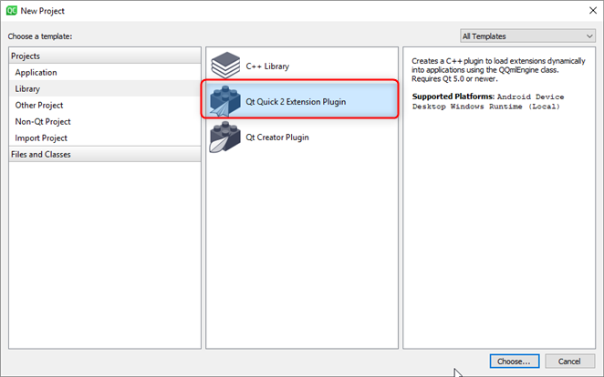
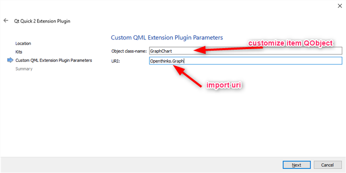
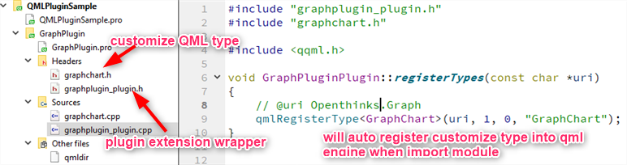
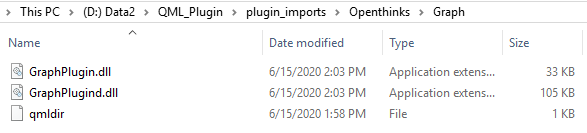
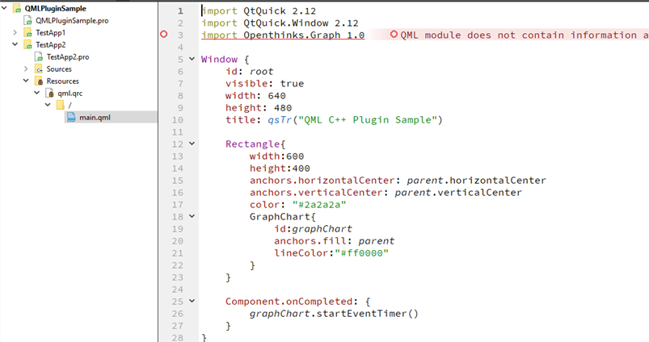
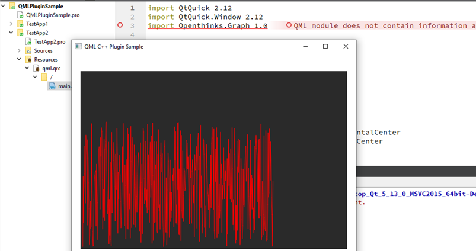
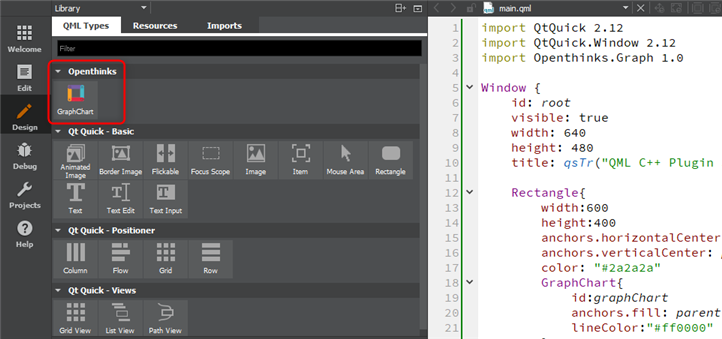

# How to Customize QML Plugin

We create a folder `plugin_imports` as all QML plugin root folder.

## Base C++

### Create plugin project

Firstly create the `Qt Quick 2 Extension Plugin` project in Qt Creator





After plugin project created, you should focus on implementing customized qml type `graphchart`.
A plugin wrapper class `GraphPluginPlugin` will auto created in project , this class will be call `registerTypes()` when do import in QML file



Also, `qmldir` file will be auto created as below.
module name: `Openthinks.Graph`, this means two points as below:
1. when use this plugin in QML file: `import Openthinks.Graph 1.0`
2. we should put this plugin file: dll/so and qmldir under folder `Openthinks/Graph`


### Delpoy plugin
Compile plugin project in Qt Creator both by debug and release, in Windows, you will get `GraphPlugind.dll` and `GraphPlugin.dll`.
Create folder `Openthinks/Graph` under root path `plugin_imports`, then copy all `dll` files and `qmldir` in to created folder.



### Use plugin
Here we create a test project to show how to use customized plugin.

Same as the previouse QML plugin base on pure QML, these two steps also need to do:
* Configuration of  `QML_IMPORT_PATH` in pro file should be set
* `QML2_IMPORT_PATH` env should be set or call `QQmlApplicationEngine::addImportPath()`

Next, we import the plugin and concreate it  in qml file.


Here, there exist error `QML module does not found` in Qt Creator code.
At this time, ignore it first, just run this test project, it will be OK.


### Generate .qmltypes

```shell
# qmlplugindump <module name> <module version> <module root path>
qmlplugindump -nonrelocatable Openthinks.Graph 1.0 /path/plugin_imports > /path/plugin_imports/Openthinks/Graph/plugin.qmltypes
```
NOTE: `/path/plugin_imports/Openthinks/Graph` in this folder, should include plugin compiled lib `GraphPlugin.dll`(release version lib at least)

The content of `plugin.qmltypes`  as below:
```
import QtQuick.tooling 1.2

// This file describes the plugin-supplied types contained in the library.
// It is used for QML tooling purposes only.
//
// This file was auto-generated by:
// 'qmlplugindump -nonrelocatable Openthinks.Graph 1.0 D:\QML_Plugin\plugin_imports'

Module {
    dependencies: ["QtQuick 2.0"]
    Component {
        name: "GraphChart"
        defaultProperty: "data"
        prototype: "QQuickPaintedItem"
        exports: ["Openthinks.Graph/GraphChart 1.0"]
        exportMetaObjectRevisions: [0]
        Property { name: "lineColor"; type: "QColor" }
        Signal {
            name: "receivedData"
            Parameter { name: "newData"; type: "double" }
        }
        Method {
            name: "onReceivedData"
            Parameter { name: "newData"; type: "double" }
        }
        Method { name: "onVisibleChanged" }
        Method { name: "startEventTimer" }
        Method { name: "stopEventTimer" }
    }
}
```

Modify `qmldir` file, then close Qt Creator and reopen, it will be OK.
```
module Openthinks.Graph
plugin GraphPlugin
typeinfo plugin.qmltypes
```

### Support Designer
When switch to Qt Creator Design model, if we need make our new plugin type show in the `QML Types`, we should do the following steps:
1. create a folder `designer` under `plugin_imports\Openthinks\Graph`
2. add `.metainfo` file and reference resource icon
```
MetaInfo {
    Type {
        name: "Openthinks.Graph.GraphChart"
        icon: "images/openthinks.png"

        ItemLibraryEntry {
            name: "GraphChart"
            category: "Openthinks"
            libraryIcon: "images/openthinks.png"
            version: "1.0"
            requiredImport: "Openthinks.Graph"
            Property { name: "width"; type: "int"; value: 120 }
            Property { name: "height"; type: "int"; value: 80 }
        }
    }
}
```




###  Reference links

[Module Definition qmldir Files](https://doc.qt.io/qt-5/qtqml-modules-qmldir.html)

[Writing QML Extensions with C++](https://doc.qt.io/qt-5/qtqml-tutorials-extending-qml-example.html)

[Qml组件化编程10-自定义Quick模块](https://jaredtao.github.io/2019/06/01/Qml%E7%BB%84%E4%BB%B6%E5%8C%96%E7%BC%96%E7%A8%8B10-%E8%87%AA%E5%AE%9A%E4%B9%89Quick%E6%A8%A1%E5%9D%97/)